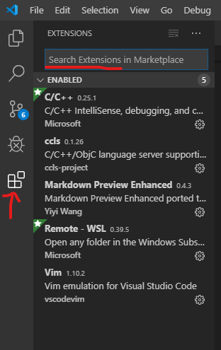
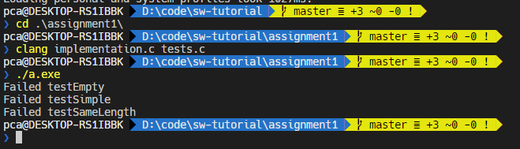
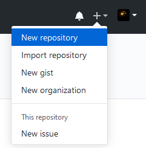
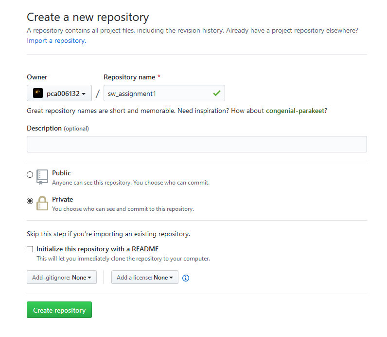
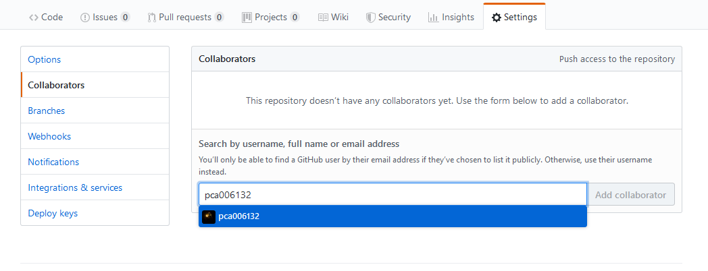

# Software Tutorial Assignment 1

Due: 22/9/2019

## Problem Definition
To find the first maximum consecutive repeating character in a string.

## Examples
* `""`: The maximum consecutive repeating character is `\0`, which occurred once.
* `"aabbbab"`: The maximum consecutive repeating character is `b`, which have a length 3.
* `"aacbbbccc"`: The first maximum consecutive repeating character is `b`, as the pattern occurred before the 3 `c`s.

## Instruction
1. Complete the `implementation.c`.
2. State your ITSC account at the start of the `implementation.c`. For example: `//ITSC: cklamaq` at the first line.
3. Compile both the `implementation.c` and `tests.c`.
4. Run the executable generated.
5. Create a private repository and add `pca006132` as collaborator.
6. Commit and push the code to the repository.

The `tests.c` contains simple test cases for you to test. 
The assignment would be graded using a different set of test cases.

> Please refer to environment setup section for details.

## Grading Scheme
* Full Mark: 10.
* Successful submission: 2 Marks.
* 3 test cases, each pass would add 2 Marks. Total 6 Marks.
* Naming convention: 1 Mark.
* Formatting using clang-format: 1 Mark.

## Environment Setup
> For **Windows** users, select **Add to PATH** when you see the option during installation.

1.  Install [Git](https://git-scm.com/downloads).
2.  Install [LLVM](http://releases.llvm.org/download.html) for the clang compiler and clang-format tool. (prebuilt binary for your platform)
> For Windows users, install [Build tools for Visual Studio](https://visualstudio.microsoft.com/downloads/#build-tools-for-visual-studio-2017). Scroll down, select tools for visual studio 2019, build tools for visual studio 2019. After running the program, select tools for C++.
> 
> For Mac users, use `brew install git llvm`.

3.  Install [VSCode](https://code.visualstudio.com/) as the editor if you don't have any preferred editor.  
    Install C/C++ extension pack.  
      
4. Use terminal to go to the `assignment1` directory of this repository, and compile the program using `clang implementation.c tests.c`, and run the `a.exe` (for windows) or `a.out` for *nix operating systems.  
   
5.  Create a private repository in GitHub and add `pca006132` as the collaborator.  
      
      
    

6. Follow the *…or push an existing repository from the command line* instruction to publish your code.

## Naming Convention
* Lower camel case for function and variable.
* Upper camel case for structure, union.
* All caps snake case for macro.
* Snake case for file names.

## Clang-Format
1. Open the repository directory. Open the file you want to format.
2. Open the command palette in VSCode (Ctrl+Shift+P in Windows, check **view** > **Command Palette** for other operating systems).
3. Type `Format Document` and press enter.

